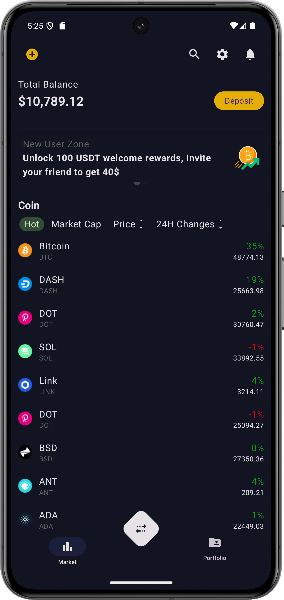
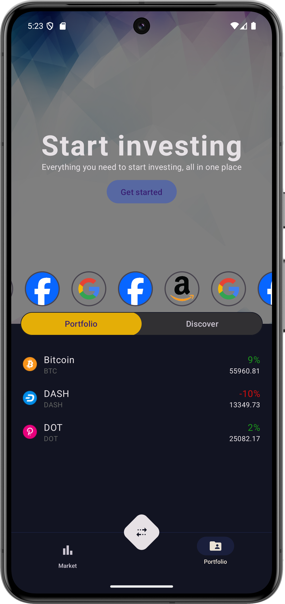
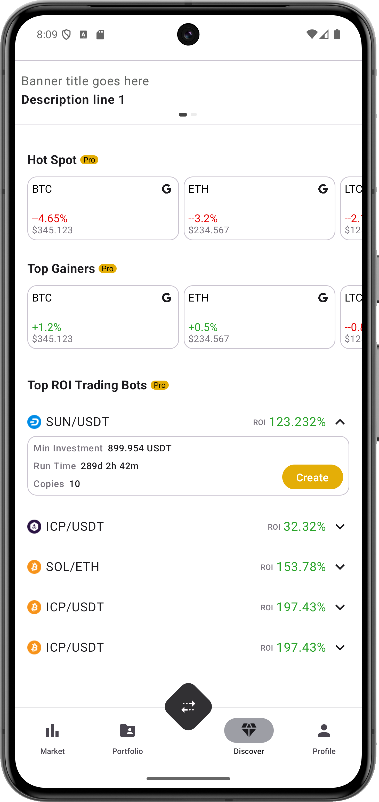

# HappyCrypto

## Description
This project demonstrates advanced techniques in data caching, user interface (UI) design, and dynamic UI rendering. By incorporating a Server-Driven UI approach, the project enables flexible, real-time updates to the UI without requiring app updates, ensuring that users always have the most current experience.

## Features
- **Data Caching:**: To optimize the UI loading experience on the Portfolio screen, a data caching strategy is implemented. Initially, if no data is available, it is fetched from the network and stored in memory. This approach prevents the need for loading screens, providing a smoother user experience. Additionally, data can be cached in a local database. When the application is launched, the system first checks memory for the data. If the data isn't found in memory, the database is queried. Only if both the memory and database checks fail is the data fetched from the network.
- **User-Friendly Interface:** Designed with a focus on simplicity and ease of use
- **Server-Driven UI**: The newly added Discover feature leverages a Server-Driven UI (SDUI) approach. In a Server-Driven UI, the server dictates the structure and content of the UI, allowing for greater flexibility and dynamic updates without requiring a client-side application update. This method enables the app to render new or updated layouts and components as dictated by the server, ensuring that users always experience the most current version of the UI without needing to update the app. This is particularly beneficial for quickly iterating on UI design and delivering personalized content based on user data or server-side logic. For more details on implementing Server-Driven UI, you can refer to my medium [article](https://medium.com/@matinfard.y/implementing-server-driven-ui-in-android-part-1-09c4f517a0a1).

## Screenshots

### Market Screen

### Portfolio Screen

## Discover Screen(Server-Driven)

