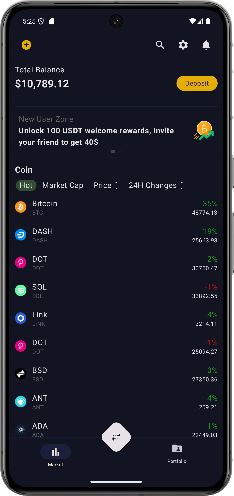

# Crypto

## Description
This project demonstrates techniques in data caching and user interface (UI) design.

## Features
- **Data Caching:**: To optimize the UI loading experience on the Portfolio screen, a data caching strategy is implemented. Initially, if no data is available, it is fetched from the network and stored in memory. This approach prevents the need for loading screens, providing a smoother user experience. Additionally, data can be cached in a local database. When the application is launched, the system first checks memory for the data. If the data isn't found in memory, the database is queried. Only if both the memory and database checks fail is the data fetched from the network.
- **User-Friendly Interface:** Designed with a focus on simplicity and ease of use
## Screenshots

### Market Screen

### Portfolio Screen

